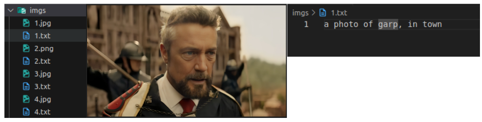
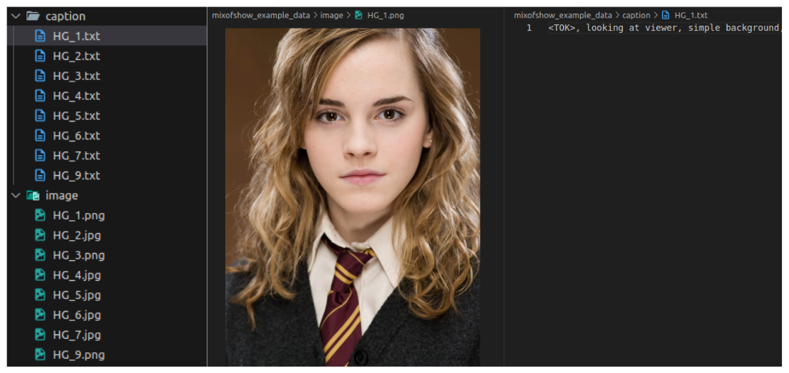

# LoRA Getting Started

In this tutorial, I will show you how to get started with LoRA training for Stable Diffusion model (v1.5). There are 3 different approaches:

1. Use the repo of Kohya (https://github.com/kohya-ss/sd-scripts):
    - Pros:
        - These LoRA weights can be used in both **Stable Diffusion WebUI A111** (https://github.com/AUTOMATIC1111/stable-diffusion-webui) and diffusers library
        - **They have some magics to make the outputs look better LOL.**
    - Cons: Really difficult to customize the model / training process.
2. Use the scripts of diffusers library.
    - Pros: Easy to use
    - Cons: Difficult to customize. I am not sure if we can use it in A1111 :D
3. Use a custom training scripts: I will use the codebase of Mix-of-Show paper (https://github.com/TencentARC/Mix-of-Show) as example.
    - Pros: Useful for research purposes.
    - Cons: 
        - The output we get might be slightly worse than diffusers and kohya scripts (technical details)
        - Can not use in A1111, can not use in diffusers "directly" (i.e. we need to rewrite the pipeline ourselves)
        - Need a deep understanding about the components of SD
    
Before starting:
- You should have a machine with **cuda >= 11.8** installed and a GPU with at least 8 GB of memory. In the following example, I perform on cuda version 12.1.
- Python version should be **>= 3.9**
- All of the approaches have the same `bitsandbytes` installation process (see section 1.1)


## 1. Kohya sd-scripts

Note:
- Kohya sd-scripts support 3 types of fine-tuning: 
    - Textual Inversion (train only the new added text embedding vectors)
    - DreamBooth (train the whole network and the new added text embedding vectors)
    - LoRA (train parts of the network by using LoRA technique) **<--- What we care about.**
- For **DreamBooth + LoRA**, which is always applied in research paper, this approch will be not suitable.

### 1.1. Installation

Let's clone the repo of Kohya repository:

```bash
git clone https://github.com/kohya-ss/sd-scripts
cd sd-scripts
```

Install the common dependencies:

```bash
pip install --no-cache-dir torch==2.1.2 torchvision==0.16.2 --index-url https://download.pytorch.org/whl/cu121
pip install -r requirements.txt
pip install xformers==0.0.23 --no-dependencies
pip install diffusers
pip install -e .
```

Install bitsandbytes library (for efficient training with AdamW8Bit optimizer):

```bash
wget "https://github.com/TimDettmers/bitsandbytes/archive/refs/tags/0.41.0.zip" -O bitsandbytes-0.41.0.zip
unzip bitsandbytes-0.41.0.zip
cd bitsandbytes-0.41.0

# CUDA_VERSIONS in {110, 111, 112, 113, 114, 115, 116, 117, 118, 119, 120, 121}
# make argument in {cuda110, cuda11x, cuda12x}
# check pytorch installed cuda version (as above, I install pytorch with cuda 12.1)

CUDA_VERSION=121 make cuda12x
python setup.py install
```

### 1.2. Download pre-trained weights

We need to use the pre-trained weights in `safetensors` format (such as the file `v1-5-pruned-emaonly.safetensors` in this [link](https://huggingface.co/runwayml/stable-diffusion-v1-5/tree/main))

You can use whatever weights you want, but in this tutorial, I will use the weights from the link above:

```bash
mkdir ckpt
cd ckpt
wget https://huggingface.co/runwayml/stable-diffusion-v1-5/resolve/main/v1-5-pruned-emaonly.safetensors
```

### 1.2. Training data and configs

Download the example data and put in folder `data`: [Google Drive](https://drive.google.com/file/d/1OiHBeD78Bis6P7L-GGYukzG80CqWnIgJ/view?usp=sharing)

<p align='center'>

</p>

Basically, we need image files related to a specific character, and each image file is associated with a **caption file** to describe the content of the image.
- We should use a special token to "represent" the character. For example, I use the token `garp`. Other things in the caption file can decribe other details such as the background.
- Example for a caption: `a photo of garp, in town`

I believe you can understand the things described in the `.toml` files :D

### 1.3. Start the training

We will use the file `train_network_config.toml` for training:

```bash
accelerate launch \
    --num_cpu_threads_per_process=4 \
    "train_network.py" \
    --config_file=lora_example_training_data/train_network_config.toml
```

### 1.4. Inference

As I mentioned above, the trained LoRA weights can be test in **Stable Diffusion WebUI A111** and diffusers.

Basic usage with diffusers:
```python
from diffusers import StableDiffusionPipeline
import torch
import xformers

pipeline = StableDiffusionPipeline.from_single_file("ckpt/v1-5-pruned-emaonly.safetensors",
                                                    torch_dtype=torch.float16).to("cuda")
pipe.enable_xformers_memory_efficient_attention()
pipeline.load_lora_weights("path/to/lora/weights", weight_name="lora_weight_name.safetensors")
image = pipeline("something here").images[0]
```

Advance usage: https://huggingface.co/docs/diffusers/main/en/tutorials/using_peft_for_inference

## 2. Diffusers scripts

The diffusers library provides several training scripts, e.g:
- [LoRA](https://github.com/huggingface/diffusers/blob/main/examples/text_to_image/README.md#training-with-lora) (like kohya scripts, but in fact the results are not as good as kohya)
- [DreamBooth LoRA](https://github.com/huggingface/diffusers/blob/main/examples/dreambooth/README.md#training-with-low-rank-adaptation-of-large-language-models-lora)

Their documentation is actually very good, so I will not repeat here. You can follow the instructions in the links above.

## 3. Custom training scripts - Mix-of-Show

In a custom training scripts, we will need to define the data loading process, the LoRA architecture, specify type of weights to applied LoRA, perform the training loop,...

I will use the codebase of Mix-of-Show paper as the example.
- You can read the LoRA implementation of Mix-of-Show [here](https://github.com/TencentARC/Mix-of-Show/blob/main/mixofshow/models/edlora.py#L221)
- Mix-of-Show also implements some advanced loss component, e.g. [attention regression loss](https://github.com/TencentARC/Mix-of-Show/blob/main/mixofshow/pipelines/trainer_edlora.py#L263) (but it requires the mask for our concept in each training image)
- The technique use here is **P+** (extended version of Textual Inversion) and **DreamBooth LoRA**, i.e. we will train the new added text embedding vectors and parts of network based on LoRA technique.

### 3.1. Installation

You can use the same conda environment with Kohya sd-scripts

Let's clone their repository:

```bash
git clone https://github.com/TencentARC/Mix-of-Show
cd Mix-of-Show
```

For Mix-of-Show codebase, we have to use pre-trained weights in standard diffusers format (i.e. we just need to specify the hugging face repo of that pre-trained weights)
- E.g. `stablediffusionapi/realistic-vision-v51` for the Realistic Vision V5.1 weights.

### 3.2. Training data and config

Download the example data and put in folder `data`: [Google Drive](https://drive.google.com/file/d/1Z078BBgxcL2A1NvuVWdi6wxuLYHs-MMy/view?usp=sharing)

<p align='center'>

</p>

We still need a caption file associated with each image file. The caption file should contain the token to represent the character (`<TOK>` in this example, it is quite different from kohya scripts).

The training setting such as optimizer, learning rate,... can be found in the config `yml` file. LoRA `rank` is currently set to 4.

**Note.** In the provided configs, I ignore the usage of mask in training. You can try it by changing the following lines:
- `attn_reg_weight` should be **only** use when `use_mask: true`
```python
# dataset and data loader settings
datasets:
  train:
    use_mask: true
models:
  attn_reg_weight: 0.01
  reg_full_identity: false  # optional
  use_mask_loss: false   # optional
```

### 3.3. Start training

We will use the file `train_edlora.py` for training:

```bash
accelerate launch train_edlora.py -opt data/mixofshow_example_data/EDLoRA_hermione_RV51.yml
```

The validation visualization process will start at the end of the training process.

### 3.4. Inference

You can use the trained LoRA weights to sample on new prompt with the following steps:
- Create a new prompt `test.txt` file.
- Change the path in config file at the path `experiments/EDLoRA_hermione_RV51.yml/EDLoRA_hermione_RV51.yml`:

```python
datasets:
  val_vis:
    prompts: path_to_test.txt_file
```

- Then run the following command:

```bash
accelerate launch test_edlora.py -opt experiments/EDLoRA_hermione_RV51.yml/EDLoRA_hermione_RV51.yml \
    --lora-path experiments/EDLoRA_hermione_RV51.yml/models/edlora_model-latest.pth \
    --save-dir experiments/EDLoRA_hermione_RV51.yml/visualization_test
```

### 3.5. Follow up

In this codebase, we can try to perform some advanced techniques, e.g.:
- Different LoRA techniques: KronA, DoRA
- Different loss components.
